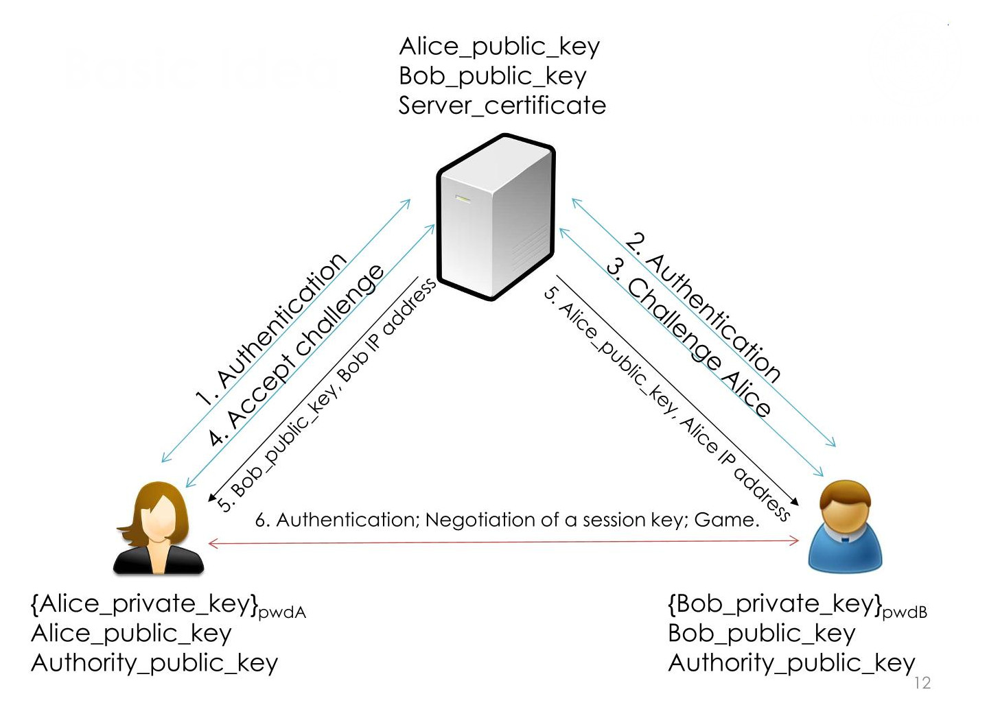

# Four-in-a-Row Online

The goal of the project is to desing and implement a client-server application for the &quot;Four-in-a-Row&quot; game.

**Constraint:**

- Use C or C++  language and OpenSSL library for crypto algorithms
- Key establishment protocol must establish one(or more) symmetric session key(s) with public-key crypto
- Session protocol must use session key(s) to communicate
- Communication must be confidential authenticated and protected against replay
- No coding vulnerabilities(use secure coding principles)
- Manage malformed messages

**Assumption:**

- The board is a 6x7(rows,columns)
- Users are already registered on the server through public keyes. Users authenticate through said public key
- The game board must be printed at each move.
- When a client wants to top playing. It shall log-off from the server

##

## Report:

Project report must contain:

- Project specification and design choices
- BAN-logic proof of key exchange protocol
- Format of all the exchanged messages

**Application example flow:**

- After  the log-in a user can see other availabile users logged to the server
- User can send a challenge to another user
- The user who receives a challenge can either accept or refuse
- If the challenge is accepted, the users proceed to play using a peer-to-peer communication
- When the client application starts, Server and Client must authenticate
  - Server must authenticate with a public key certified by a certification authority
  - Client must authenciate with a public key(pre-installed on server). The corresponding private key is protected with a password on each client
- After authentication a symmetric session key must be negotiated
  - The negotiation must provide Perfect Forward Secrecy
  - All session messages must be encrypted with authenticated encryption mode(eg. CCM,GCM)
  - Session with a server is not interrupted by games
  - After a challenge is accepted he server sends to both clients the ip address and public key of the adversary
- Before starting the game a symmetric session key must be negotiated
  - The negotiation must provide Perfect Forward Secrecy
  - All session messages must be encrypted with authenticated encryption mode(e.g. CCM,GCM)
- When  the game ends, clients disconnect fro each other
